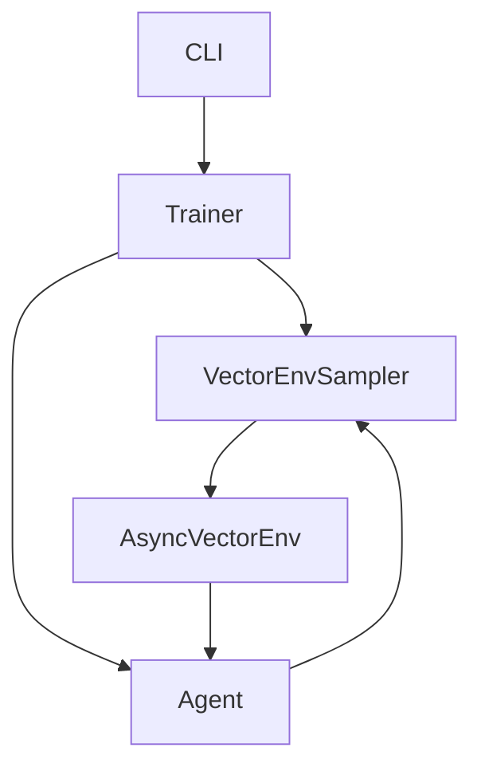

# VibeRL

<p align="center">
  
</p>

<p align="center">
  <a href="https://0xwelt.github.io/VibeRL/"></a>
  <a href="https://github.com/0xWelt/VibeRL/actions"></a>
  <a href="https://github.com/0xWelt/VibeRL/actions/workflows/pytest.yml"></a>
  <a href="https://codecov.io/gh/0xWelt/VibeRL"></a>
  <a href="https://www.python.org/downloads/"></a>
  <a href="https://pytorch.org/"></a>
  <a href="https://gymnasium.farama.org/"></a>
  <a href="https://opensource.org/licenses/MIT"></a>
</p>

A modern Reinforcement Learning framework for education and research, built with type safety and modern Python practices.

## Quick Start

### Installation

```bash
# Install with uv
uv pip install -e ".[dev]"

# Or with pip
pip install -e ".[dev]"
```

### Basic Usage

```bash
# Train REINFORCE
viberl-train --alg reinforce --episodes 1000 --grid-size 10

# Train PPO with parallel environments
viberl-train --alg ppo --episodes 1000 --num-envs 4 --trajectory-batch 8

# Evaluate trained model
viberl-eval --model-path experiments/*/final_model.pth --episodes 10 --render

# Run demo
viberl-demo --episodes 5 --grid-size 15
```

### Python API

```python
from viberl.agents import REINFORCEAgent
from viberl.envs import SnakeGameEnv
from viberl.trainer import Trainer

# Create environment and agent
env = SnakeGameEnv(grid_size=10)
agent = REINFORCEAgent(state_size=100, action_size=4, learning_rate=0.001)

# Train
trainer = Trainer(env=env, agent=agent, num_envs=4, batch_size=8)
trainer.train(num_episodes=1000)
```

## Features

- **Modern Python**: Type-safe design with Pydantic
- **Multiple Algorithms**: REINFORCE, DQN, PPO
- **Parallel Training**: AsyncVectorEnv support
- **Experiment Tracking**: Auto directory structure with TensorBoard
- **CLI Interface**: Complete training, evaluation, and demo commands

## Architecture

### Component Overview

| Component | Purpose | Key Classes |
|:----------|:--------|:------------|
| **Agents** | RL Algorithms | `REINFORCEAgent`, `DQNAgent`, `PPOAgent` |
| **Environments** | Simulation | `SnakeGameEnv` |
| **Networks** | Neural Networks | `PolicyNetwork`, `ValueNetwork` |
| **Sampling** | Data Collection | `VectorEnvSampler` |
| **Training** | Training Loop | `Trainer` |

### Training Pipeline



## Algorithms

- **REINFORCE**: Policy gradient with Monte Carlo returns
- **DQN**: Deep Q-Network with experience replay
- **PPO**: Proximal Policy Optimization with clipping

## Development

```bash
# Run tests
pytest -n 8

# Format code
ruff format viberl/
ruff check viberl/ --fix

# Build docs
mkdocs serve
```

## Citation

```bibtex
@software{viberl2025,
  title={VibeRL: Modern Reinforcement Learning with Vibe Coding},
  author={0xWelt},
  year={2025},
  url={https://github.com/0xWelt/VibeRL},
}
```

## ⭐ Star History

[](https://star-history.com/#0xWelt/VibeRL&Date)

## License

[MIT License](https://github.com/0xWelt/VibeRL/blob/main/LICENSE)
